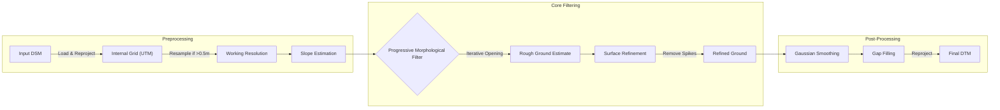

# dsm2dtm


**Generate DTM (Digital Terrain Model) from DSM (Digital Surface Model)**

[](https://github.com/seedlit/dsm2dtm/actions/workflows/ci.yml)
[](https://pypi.org/project/dsm2dtm/)
[](https://anaconda.org/conda-forge/dsm2dtm)
[](LICENSE)

`dsm2dtm` is a robust, python library for extracting bare earth Digital Terrain Models (DTM) from Digital Surface Models (DSM). It effectively removes non-ground features like buildings, vegetation, and cars, leaving only the underlying terrain.

Key features:
*   **Pure Python**: No external binary dependencies (no SAGA, no GDAL CLI). Just `numpy`, `scipy`, and `rasterio`.
*   **Robust**: Handles noise, cliffs, and varied resolutions automatically.
*   **Adaptive**: Automatically tunes parameters based on input resolution and terrain slope.
*   **Easy to Use**: Simple CLI and a clean Python API for developers.

---

## Installation

### Via Pip
```bash
pip install dsm2dtm
```

### Via Conda
```bash
conda install -c conda-forge dsm2dtm
```

### From Source
```bash
git clone https://github.com/seedlit/dsm2dtm.git
cd dsm2dtm
pip install .
```

---

## Usage

### 1. Command Line Interface (CLI)

The simplest way to use `dsm2dtm` is via the command line.

```bash
dsm2dtm --dsm input_dsm.tif --out_dir output/
```

**Arguments:**
*   `--dsm`: Path to the input DSM (GeoTIFF).
*   `--out_dir`: Directory where the output DTM will be saved (default: `generated_dtm`).
*   `--radius`: (Optional) Kernel radius in meters for object removal. Larger values remove larger buildings but are slower. Default: 40.0.
*   `--slope`: (Optional) Terrain slope (0-1). Calculated automatically if not provided.

### 2. Python Library

You can integrate `dsm2dtm` into your own Python pipelines. We provide high-level and low-level APIs.

#### High-Level API (File-based)
```python
from dsm2dtm import generate_dtm, save_dtm

input_path = "data/input_dsm.tif"
output_path = "results/output_dtm.tif"

# 1. Generate DTM (returns numpy array and profile metadata)
dtm_array, profile = generate_dtm(input_path)

# 2. Save to disk
save_dtm(dtm_array, profile, output_path)
```

#### Low-Level API (Numpy-based)
Ideal for in-memory processing or integration with other libraries like `xarray`.

```python
import rasterio
from dsm2dtm.algorithm import dsm_to_dtm

# Load data yourself
with rasterio.open("input_dsm.tif") as src:
    dsm = src.read(1)
    res = src.res  # (x_res, y_res)
    nodata = src.nodata

# Run algorithm on raw numpy array
dtm = dsm_to_dtm(dsm, resolution=res, nodata=nodata)

# dtm is a float32 numpy array
```

---

## How It Works

The library implements an optimized version of the **Progressive Morphological Filter (PMF)** combined with surface refinement.



1.  **Resolution Adaptation**: Parameters are scaled automatically based on the input pixel size. High-resolution inputs (>0.5m) are optionally downsampled for stability and speed, then upsampled back.
2.  **Slope Estimation**: Local terrain slopes are calculated to adapt the filtering thresholds.
3.  **Progressive Morphological Filter (PMF)**: Iteratively applies morphological opening (erosion followed by dilation) with increasing window sizes. This effectively "shaves off" objects that stick out above the ground surface.
4.  **Refinement**: A smoothing step compares the rough ground estimate with the original surface to recover over-smoothed details while rejecting spikes.
5.  **Gap Filling**: Any remaining holes (nodata) are filled using inverse distance weighting or nearest neighbor interpolation.

---

## Contributing

We welcome contributions!

### Setup
We use `uv` for dependency management and `pre-commit` for code quality.

```bash
# 1. Clone
git clone https://github.com/seedlit/dsm2dtm.git

# 2. Install dependencies
uv sync --all-extras

# 3. Install hooks
pre-commit install
```

### Running Tests
We use `pytest` for testing. The suite includes unit tests, stress tests, and integration tests with real-world data (downloaded automatically).

```bash
# Run all tests
uv run pytest

# Run only stress tests
uv run pytest tests/test_stress.py
```

## License

MIT License. See [LICENSE](LICENSE) for details.
